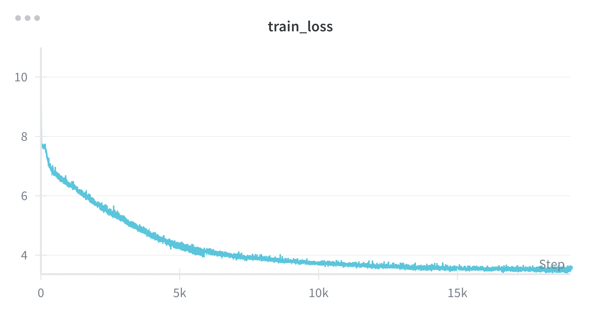
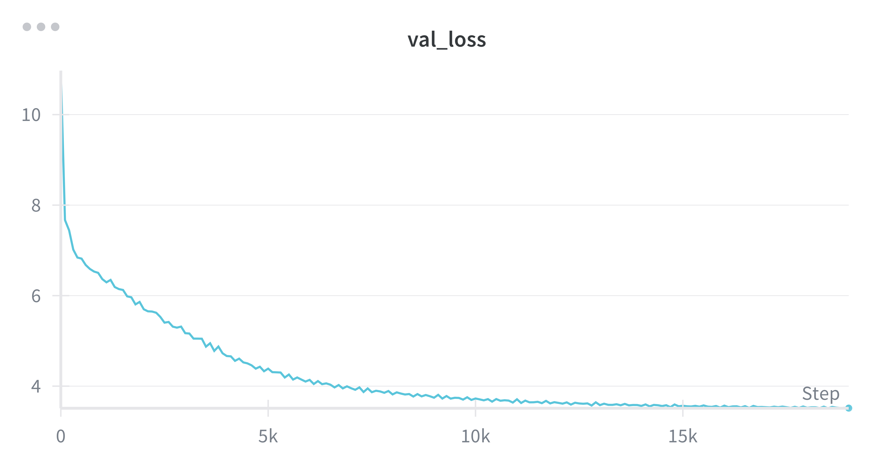

# GPT-2 From-Scratch Training & Inference

This repository contains an end-to-end PyTorch reproduction of the GPT-2 architecture, including tooling to build a tokenized dataset, train with multi-GPU data parallelism, and sample text from saved checkpoints. It is adapted from the educational work surrounding nanoGPT, with configurability for larger-scale experiments on the FineWeb EDU corpus.

## Repository At A Glance
- `src/model.py`: GPT-2 transformer blocks, multi-head attention, MLP, and Hugging Face weight loader.
- `src/trainer.py`: Training loop with gradient accumulation, `torch.compile`, DistributedDataParallel, scheduled checkpointing, and Weights & Biases logging.
- `src/dataloader.py`: Minimal iterable loader that streams pre-tokenized shards (see Dataset section).
- `src/lr_schedule.py`: Three-phase LR schedule (linear warmup, cosine decay, constant floor) tunable through `LRScheduleConfig`.
- `src/generate.py`: Text generation entry point that restores a checkpoint and produces top-k sampled continuations while tracking perplexity.
- `src/fineweb_edu.py`: Utility script to download and tokenize the FineWeb EDU dataset into `.npy` shards.
- `setup_conda.sh`: One-shot Miniconda + environment bootstrapper targeting Python 3.11.

## Requirements
- Python 3.11 (the bootstrapper installs Miniconda with an `llm` environment).
- PyTorch 2.8 with CUDA support for training on GPUs; CPU-only runs are supported for inference.
- A GPU cluster with NCCL-compatible interconnect for multi-GPU (the default trainer assumes distributed execution).
- Optionally, a Weights & Biases account for experiment tracking (`WANDB_API_KEY` should be exported beforehand).

All Python dependencies are pinned in `requirements.txt` and include Hugging Face `datasets`, `transformers`, `tiktoken`, and tooling for data preparation and logging.

## Environment Setup
### Option 1 – Automated Conda environment
```bash
./setup_conda.sh
conda activate llm
```
The script installs Miniconda under `~/miniconda3`, creates an environment named `llm`, and installs requirements.

### Option 2 – Manual virtualenv
```bash
python3.11 -m venv .venv
source .venv/bin/activate
pip install --upgrade pip
pip install -r requirements.txt
```

## Dataset Preparation
The trainer expects pre-tokenized shards produced by `src/fineweb_edu.py`:

1. Authenticate with Hugging Face Hub if needed: `huggingface-cli login`.
2. Edit the target directory inside `src/fineweb_edu.py` if you want to place shards somewhere other than the project root (`np.save('fineweb/...')`).
3. Run the tokenizer:
   ```bash
   python -m src.fineweb_edu
   ```
   Each shard contains up to 100M GPT-2 BPE tokens saved as `fineweb/shard_{train|val}_*.npy`.

The lightweight loader in `src/dataloader.py` currently reads from `/home/ubuntu/fineweb/sample_10b`. Point it to your shard directory by either:
- Updating the `DATASET_PATH` constant, or
- Creating a symlink (e.g., `ln -s /path/to/fineweb fineweb_sample_10b` and adjusting the constant).

Shards are round-robined across processes. The first validation shard should be named with `val` to match the default glob.

## Training
The default configuration models GPT-2 Small (12 layers, 768 hidden units, 12 heads, 1024 context length). Key hyperparameters live in `src/model_config.py` (`GPT2Config`, `TrainerConfig`) and `src/lr_schedule.py` (`LRScheduleConfig`).

1. Confirm checkpoints and dataset paths inside `src/trainer.py` align with your environment (especially the `torch.save` destination).
2. Export W&B variables if you use logging:
   ```bash
   export WANDB_API_KEY=<your_key>
   export WANDB_PROJECT=gpt2
   export WANDB_ENTITY=<your_entity>
   ```
3. Launch distributed training via `torchrun`:
   ```bash
   torchrun --nproc_per_node=<num_gpus> src/trainer.py
   ```

The trainer performs gradient accumulation to reach the global batch configured by `TrainerConfig.batch_size`. Checkpointing occurs every 5000 steps to `/home/ubuntu/fineweb/model_checkpoints` by default; adjust the path for your filesystem. Validation runs every 100 training steps using `validation_steps` from the LR config.

## Training Progress
These snapshots come from the latest Weights & Biases run. Training loss is averaged over gradient accumulation steps; validation loss reflects the 20 micro-batch sweep every 100 steps.




### Run Configuration
- Model: GPT-2 Small (`n_layers=12`, `d_model=768`, `n_heads=12`, `block_size=1024`, `vocab_size=50257`).
- Global batch: `TrainerConfig.batch_size = 2**19` tokens (524,288 token targets); per-GPU micro-batches use 64 sequences x 1,024 tokens with gradient accumulation so the same global batch holds across world sizes.
- Optimizer: fused `AdamW` with `betas=(0.9, 0.95)` and `weight_decay=0.1`; gradients are clipped to `max_norm=1.0`.
- Precision: `torch.autocast` runs compute in bfloat16 while parameters stay in FP32; `torch.compile` is enabled before wrapping with DDP.
- Learning rate: starts at `6e-4` with 25 warmup steps (~12.5M tokens), follows cosine decay for 16,517 steps, then holds at 10% of the peak LR until `max_steps=19,073` (~10B tokens).
- Data: streaming FineWeb EDU shards (`fineweb/sample_10b`) via `DataLoaderLite`, balanced across ranks and reset shard-by-shard.
- Evaluation cadence: every 100 training steps, each validation sweep averages 20 micro-batches and logs perplexity; Weights & Biases records train/val metrics and iteration time.

### Checkpoint Samples
We generated one 40-token continuation per checkpoint using the virtualenv interpreter:
```bash
.venv/bin/python src/generate.py --checkpoint <path> --num-samples 1 --max-tokens 40 --temperature 0.9 --top-k 50
```
Perplexity is averaged over the sampled tokens (temperature 0.9, top-k 50). Text below includes the prompt plus the sampled continuation, truncated for readability.

| Step | Sample perplexity | Continuation (truncated) |
| --- | --- | --- |
| 5,000 | 16.47 | Hello I am GPT-2, a language model that involves making it into a text, in order to provide context and understand the topic... |
| 10,000 | 6.24 | Hello I am GPT-2, a language model that was developed by C. W. Wilson in 1965. C. W. Wilson's model was the best known of the late 1950s... |
| 15,000 | 11.99 | Hello I am GPT-2, a language model that was able to run on the Internet (even when one can't), and then the program was running a software program... |
| 19,072 | 6.24 | Hello I am GPT-2, a language model that was developed by David Geyer. "GPT-2" is a computer-based language used by the Human-Computer Interaction team... |

## Inference & Text Generation
Use `src/generate.py` to sample from a checkpoint:
```bash
python src/generate.py
```
By default the script loads `model_checkpoints/model_19072.pt`, adjusts the DDP state dict, and generates four 64-token continuations from a fixed prompt using top-k sampling. Update the checkpoint path, prompt, temperature, and sampling parameters as needed. CPU generation is enabled out of the box; move the model to GPU by setting `device = 'cuda'` if available.

You can also load official Hugging Face GPT-2 weights for sanity checks via `GPT2.from_pretrained('<variant>')` (`gpt2`, `gpt2-medium`, `gpt2-large`, `gpt2-xl`).

## Customization Tips
- Edit `GPT2Config` to experiment with wider or deeper models; ensure `n_heads` divides `d_model`.
- Adjust `TrainerConfig.gpu_batch_size` to match the memory capacity of individual GPUs while keeping `batch_size` divisible by `gpu_batch_size * block_size * world_size` for integer accumulation steps.
- Tune the LR schedule by overriding `LRScheduleConfig` attributes before constructing the scheduler.
- Replace `F.scaled_dot_product_attention` in `src/model.py` with the manual implementation if targeting PyTorch versions without Flash Attention.

## Project Status & Testing
The `tests/` directory is currently empty; no automated unit tests are configured. When modifying the architecture or data loader, consider adding regression checks (e.g., activation shapes, small language modeling benchmarks) before large-scale training runs.

## Troubleshooting
- **DDP hangs**: Ensure `torchrun` environment variables (`MASTER_ADDR`, `MASTER_PORT`) are set and NCCL has permissions on the cluster fabric.
- **Dataset path errors**: Verify the shard directory exists and filenames include the `train`/`val` split strings.
- **W&B failures**: Either disable logging by guarding `wandb.init` with an environment flag or supply credentials before training.
- **Checkpoint loading**: When loading DDP checkpoints, strip the leading `module.` prefix as shown in `src/generate.py` or save single-GPU weights by accessing `model.module.state_dict()` during training.

## Acknowledgements
Inspired by Andrej Karpathy's nanoGPT and related open-source GPT-2 replications. Uses Hugging Face datasets, tokenizers, and transformers for validation against reference checkpoints.
